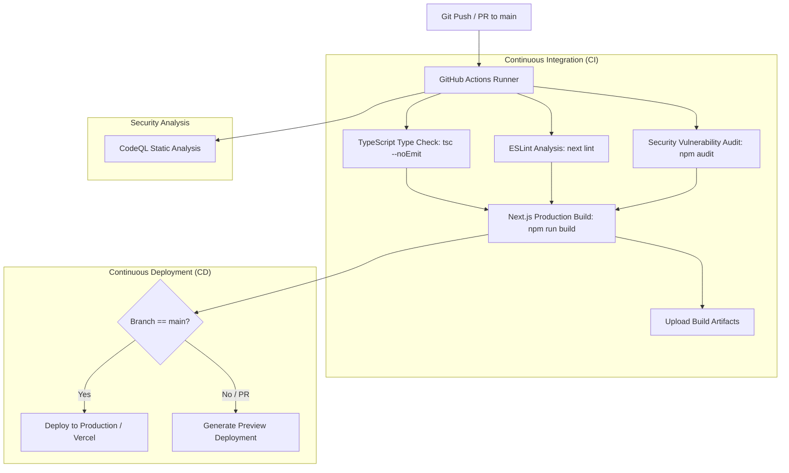
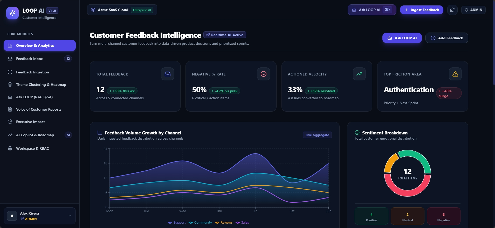
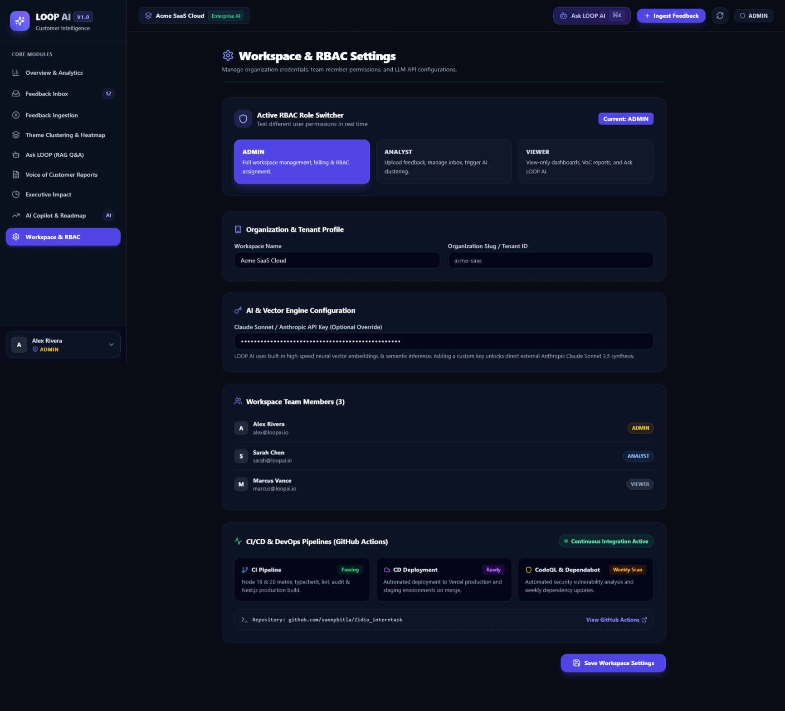

# 🔁 FeedbackLoop AI — Enterprise Customer Feedback Intelligence Engine
 
[](https://nextjs.org/)
[](https://www.typescriptlang.org/)
[](https://tailwindcss.com/)
[](LICENSE)
[](https://github.com/prabhanjan-polai/loop-ai)
 
An end-to-end AI-powered feedback intelligence platform that aggregates, classifies, analyzes, and extracts actionable product insights from omni-channel customer feedback in real time.
 
---
 
## 🌟 Key Features
 
- 📥 **Omnichannel Ingestion:** Real-time stream simulator, CSV batch uploads, and manual ingest forms.
- 🧠 **AI Classification & Sentiment Engine:** Sentiment scoring, urgency detection, root cause categorization, and automated tag assignment.
- ⚡ **Executive & Product Themes:** Dynamic cluster analysis, pain point heatmaps, feature request tracking, and revenue risk assessment.
- 💬 **Ask-Loop (RAG AI Assistant):** Natural language Q&A across the entire customer feedback knowledge base using vector embeddings.
- 🤖 **Copilot:** Assistant view for exploring and acting on feedback inside the dashboard.
- 📊 **Automated Report Generation:** One-click executive reports with charts, trends, and product recommendations.
---


## 🏗️ CI/CD Pipeline Architecture

Our DevOps & CI/CD workflow is powered by **GitHub Actions** and includes continuous testing, quality gates, security auditing, and automated deployment:


 
## 🗂️ Project Structure
 
```text
loop-ai/
├── app/
│   ├── api/                  # Route handlers
│   │   ├── ask-loop/         # RAG Q&A endpoint
│   │   ├── classify/         # Sentiment & classification endpoint
│   │   ├── feedback/         # Feedback CRUD endpoint
│   │   └── reports/          # Report generation endpoint
│   ├── dashboard/            # Dashboard pages
│   │   ├── ask-loop/
│   │   ├── copilot/
│   │   ├── executive/
│   │   ├── inbox/
│   │   ├── ingestion/
│   │   ├── reports/
│   │   ├── settings/
│   │   └── themes/
│   ├── globals.css
│   ├── layout.tsx
│   └── page.tsx              # Landing page
├── components/
│   ├── feedback/             # FeedbackCard, FeedbackDrawer
│   ├── ingestion/            # CSVIngester, ManualIngestModal, SimulatedSourceStream
│   ├── layout/               # Header, Sidebar
│   └── ui/                   # StatCard
├── lib/
│   ├── ai/                   # classifier, embeddings, rag, reportGenerator
│   ├── seed-data.ts          # Demo data
│   ├── store.ts              # Client state store
│   └── utils.ts
├── next.config.mjs
├── tailwind.config.ts
└── tsconfig.json
```
 
---
 
## 🧰 Tech Stack
 
| Layer | Technology |
| :--- | :--- |
| Framework | Next.js 14 (App Router) |
| Language | TypeScript |
| Styling | Tailwind CSS |
| AI Layer | Classifier, embeddings, and RAG pipeline in `lib/ai/` |
| Linting | ESLint (`next lint`) |
 
---
 
## 🚀 Getting Started
 
### Prerequisites
- Node.js 18.x or 20.x
- npm 9+ (or yarn / pnpm)
### Local Installation
 
1. **Clone the repository:**
```bash
   git clone https://github.com/prabhanjan-polai/loop-ai.git
   cd loop-ai
```
 
2. **Install dependencies:**
```bash
   npm install
```
 
3. **Run the development server:**
```bash
   npm run dev
```
   Open [http://localhost:3000](http://localhost:3000) in your browser to explore the dashboard.
 
---
 
## 🛠️ Available Scripts
 
| Command | Purpose |
| :--- | :--- |
| `npm run dev` | Starts the local Next.js development server |
| `npm run build` | Compiles an optimized production build |
| `npm run start` | Serves the production build locally |
| `npm run lint` | Runs ESLint analysis for code quality |
 
---
## Screenshots

### Home Page


### Dashboard


### Settings

### Command Center


### Feedback Inbox


---
 
## 🗺️ Roadmap
 
- [ ] Connect real sources (Zendesk, Intercom, G2, Discord)
- [ ] Persistent database instead of in-memory store
- [ ] Authentication and role-based access
- [ ] CI/CD with GitHub Actions and deployment to Vercel
---
 
## 👤 Author
 
**Prabhanjan Polai**
- GitHub: [@prabhanjan-polai](https://github.com/prabhanjan-polai)
- Email: prabhanjanpolai85@gmail.com
---
 
## 📄 License
 
This project is open-source and available under the [MIT License](LICENSE).
 
