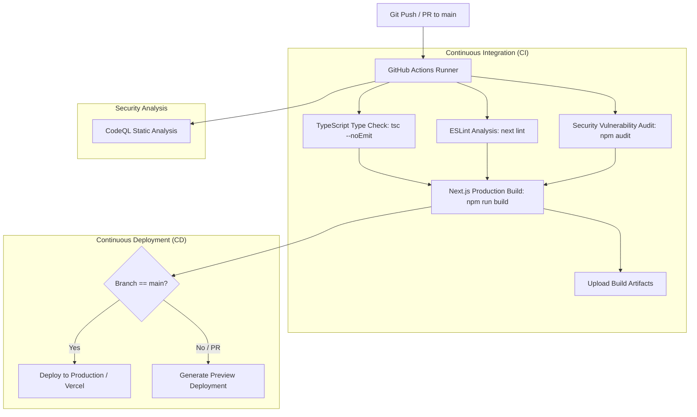

# 🔁 FeedbackLoop AI — Enterprise Customer Feedback Intelligence Engine

[](https://github.com/sunnybitla/Zidio_interntask/actions/workflows/ci.yml)
[](https://github.com/sunnybitla/Zidio_interntask/actions/workflows/cd.yml)
[](https://github.com/sunnybitla/Zidio_interntask/actions/workflows/codeql.yml)
[](https://nextjs.org/)
[](https://www.typescriptlang.org/)
[](https://tailwindcss.com/)
[](LICENSE)

An end-to-end AI-powered feedback intelligence platform that aggregates, classifies, analyzes, and extracts actionable product insights from omni-channel customer feedback in real time.

---

## 🌟 Key Features

- 📥 **Omnichannel Ingestion:** Real-time stream simulator, CSV batch uploads, Zendesk, Intercom, G2, Discord, and manual ingest forms.
- 🧠 **AI Classification & Sentiment Engine:** Sentiment scoring, urgency detection, root cause categorization, and automated tag assignment.
- ⚡ **Executive & Product Themes:** Dynamic cluster analysis, pain point heatmaps, feature request tracking, and revenue risk assessment.
- 💬 **Ask-Loop (RAG AI Assistant):** Natural language Q&A across the entire customer feedback knowledge base with vector embeddings.
- 📊 **Automated Report Generation:** One-click executive PDF exports with charts, trends, and product recommendations.
- 🚀 **Full CI/CD Automation:** Automated linting, type-checking, security vulnerability scanning, and multi-environment deployment pipelines.

---

## 🏗️ CI/CD Pipeline Architecture

Our DevOps & CI/CD workflow is powered by **GitHub Actions** and includes continuous testing, quality gates, security auditing, and automated deployment:



### 📋 CI/CD Workflows Included

| Workflow | File | Triggers | Description |
| :--- | :--- | :--- | :--- |
| **CI Pipeline** | [`.github/workflows/ci.yml`](.github/workflows/ci.yml) | `push`, `pull_request` | Validates Node 18 & 20 matrix, runs TypeScript typecheck, ESLint, npm security audit, and validates production build. |
| **CD Pipeline** | [`.github/workflows/cd.yml`](.github/workflows/cd.yml) | `push` (main), `workflow_dispatch` | Deploys production bundle to cloud target (Vercel/Cloud), supports manual dispatch with rollback/staging choice. |
| **CodeQL Security** | [`.github/workflows/codeql.yml`](.github/workflows/codeql.yml) | `push`, `pull_request`, weekly cron | Deep static analysis for security vulnerabilities and code quality. |
| **Dependabot** | [`.github/dependabot.yml`](.github/dependabot.yml) | Weekly | Automated PRs for outdated npm dependencies and GitHub Actions versions. |

---

## 🚀 Getting Started

### Prerequisites
- Node.js 18.x or 20.x
- npm 9+ or yarn / pnpm

### Local Installation

1. **Clone the repository:**
   ```bash
   git clone https://github.com/sunnybitla/Zidio_interntask.git
   cd Zidio_interntask
   ```

2. **Install dependencies:**
   ```bash
   npm install
   ```

3. **Run the development server:**
   ```bash
   npm run dev
   ```
   Open [http://localhost:3000](http://localhost:3000) with your browser to explore the dashboard.

---

## 🛠️ Available Scripts

| Command | Purpose |
| :--- | :--- |
| `npm run dev` | Starts local Next.js development server with Turbopack/HMR |
| `npm run build` | Compiles optimized production build |
| `npm run start` | Serves the production build locally |
| `npm run lint` | Runs ESLint analysis for code quality |
| `npm run typecheck` | Runs TypeScript compiler checks without emitting files |

---

## 🔐 Setting Up CI/CD Deployment Secrets

To enable automated production deployments through GitHub Actions:

1. Navigate to **Repository Settings** > **Secrets and variables** > **Actions**.
2. Add the following repository secrets:
   - `VERCEL_TOKEN`: Your Vercel account API Token
   - `VERCEL_ORG_ID`: Your Vercel Organization ID
   - `VERCEL_PROJECT_ID`: Your Vercel Project ID

---

## 📄 License
This project is open-source and available under the [MIT License](LICENSE).
